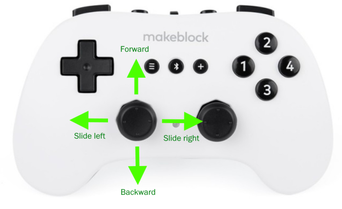
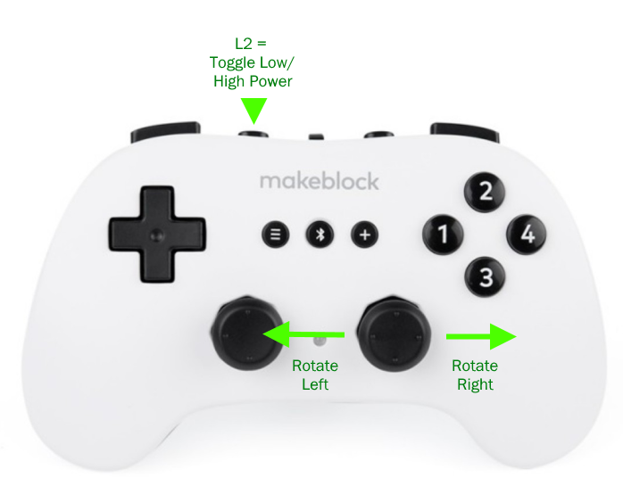
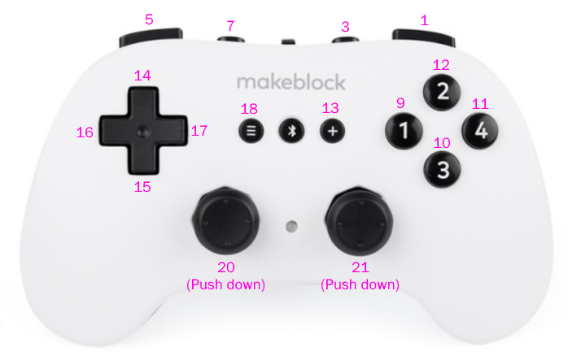
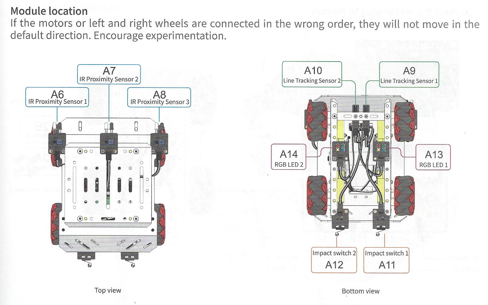
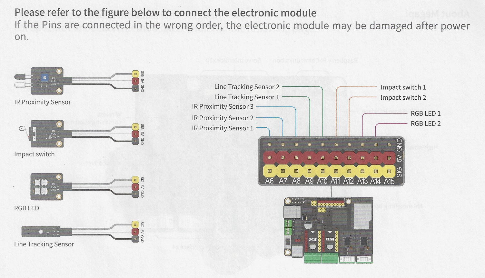

# MBot_Mega_Drive1

This program implements driving the [mBot Mega](https://store.makeblock.com/products/makeblock-mbot-mega-robot-kit) with the [Bluetooth Controller](https://www.makeblock.com/accessories/bluetooth-controller).

# Code
[MBot_Mega_Drive1.ino](MBot_Mega_Drive1.ino)

# Driving Control



## Speed Toggle (L2 Button)
By default, the motors run at max. 50% speed, due to this line:

``` 
float motor_limit = LOW_SPEED;
```

However, if you push the L2 button on the controller, it'll toggle between
LOW_SPEED (50%) and HIGH_SPEED (100%) motor limits.

Note the official documentation says not to run the motors at 100%
when you're using Bluetooth unless you're using Lithium Ion batteries, because there's not
enough power & you get Bluetooth dropouts, but you can mess around with the values.

## Proportional Power Based on Joystick

My code runs the robot faster when the joystick is pushed harder in a direction; the joystick
values are used as part of the multiplier when determining the motor power for each wheel.

# General Background on the Controller

## Joystick Analog Values
The [Makeblock library](https://github.com/Makeblock-official/Makeblock-Libraries) has this call that allows you to interrogate the controller's values:

``` 
MePS2.MeAnalog()
```

| Call              | Represents              | Values                     |
|-------------------|-------------------------|----------------------------|
| MePS2.MeAnalog(2) | Left Joystick - X Axis  | -255 (left) to 255 (right) |
| MePS2.MeAnalog(4) | Left Joystick - Y Axis  | -255 (down) to 255 (up)    |
| MePS2.MeAnalog(6) | Right Joystick - X Axis | -255 (left) to 255 (right) |
| MePS2.MeAnalog(8) | Right Joystick - X Axis | -255 (down) to 255 (up)    |

## Button Assignments
The MakeBlock library has this call you can check for a button press:
``` 
MePS2.ButtonPressed(x)
```

Where x is one of the numbers in purple:



# General Background on the Motors for the Wheels

Mine is wired like this, and I followed the factory instructions:

|    Wheel    | Port on Board | Motor # |
|:-----------:|:-------------:|:-------:|
| Left Front  |      2B       |   10    |
|  Left Rear  |      2A       |    2    |
| Right Front |      1A       |    1    |
| Right Rear  |      1B       |    9    |

If you're facing the wheel, motor.run(255) runs the wheel 
clockwise at 100% power, motor.run(-255) runs it counterclockwise at 100% power.  Example:

``` 
MeMegaPiDCMotor right_front(1);
...
right_front.run(255);   // 100% power clockwise
right_front.run(-128);  // 50% power counterclockwise
```


# Mecanum Wheel Movements

| Desired Robot Direction | Left Front | Left Rear | Right Front | Right Rear |
|-------------------------|------------|-----------|-------------|------------|
| Forward                 | ↪ CCW ️    | ↪ CCW ️   | ↩ CW        | ↩ CW       |
| Backward                | ↩ CW ️     | ↩ CW ️    | ↪ CCW ️     | ↪ CCW️     |
| Slide Left              | ↩ CW       | ↪ CCW ️   | ↪ CCW ️     | ↩ CW   ️   |
| Slide Right             | ↪ CCW ️    | ↩ CW ️    | ↩ CW ️      | ↪ CCW ️    |
| Rotate Left             | ↩ CW       | ↩ CW      | ↩ CW        | ↩ CW       |
| Rotate Right            | ↪ CCW      | ↪ CCW     | ↪ CCW       | ↪ CCW      |

# LED Modules

There are 2 LED modules with 4 LED beads each on the Mega in ports A13 and A14.  Here's how to address them in Arduino C:

The parameters to ```setColor()``` are as follows:
- Index of the bead to set (0 = all beads, or 1-4 to change an individual bead)
- Red value (0-255)
- Green value (0-255)
- Blue value (0-255)
``` 
#include "src/MeNewRGBLed.h"
MeNewRGBLed rgbled_67(67,4); // Port A13
MeNewRGBLed rgbled_68(68,4); // Port A14
...
rgbled_67.setColor(0, 0,255,0); // Green
rgbled_67.show();
rgbled_67.setColor(0, 0,0,255); // Blue
rgbled_67.show();
rgbled_68.setColor(0, 255,255,255); // White
rgbled_68.show();
rgbled_68.setColor(0, 255,0,0); // Red
rgbled_68.show();
...
rgbled_67.setColor(1,  0, 0, 0); // Turn off bead 1
rgbled_67.show();

```

# Obstacle Avoidance Sensors

There are 3 IR proximity sensors mounted to the vehicle:
- Port A6 (left)
- Port A7 (center)
- Port A8 (right)

``` 
#include "src/MeBarrierSensor.h"
MeBarrierSensor barrier_60(60); // Port A6 (left side)
MeBarrierSensor barrier_61(61); // Port A7 (center)
MeBarrierSensor barrier_62(62); // Port A8 (right side)
...
  if (barrier_62.isBarried() > 0) { 
    // Obstacle detected on right side sensor
  }
```

# Timer

``` 
double currentTime = 0;
double lastTime = 0;

double getLastTime() {
  return currentTime = millis() / 1000.0 - lastTime;
}

...

if (getLastTime() > 5.0) {       // 5.0 seconds
  // Do something here
  lastTime = millis() / 1000.0;  // Reset timer   
}

```

# Line Follow Sensors

There are 2 line sensors:
- Port A9 (left)
- Port A10 (right)

``` 
#include "src/MeSingleLineFollower.h"
MeSingleLineFollower linefollower_63(63); // Port A9 (left)
MeSingleLineFollower linefollower_64(64); // Port A10 (right)

  if ((linefollower_63.readSensor() == 0)) {
    // Left side sensor detected black
  }
  
   if ((linefollower_64.readSensor() == 1)) {
    // Right side sensor detected white
  }
```

# Crash Sensors

There are 2 crash sensors (limit switches) on the rear:
- Port A11 (left)
- Port A12 (right)

``` 
#include "src/MeCollisionSensor.h"
MeCollisionSensor collision_65(65); // Port A11 (left)
MeCollisionSensor collision_66(66); // Port A12 (right)
...
  if (collision_66.isCollision()) {
    // Right side sensor detected collision
  }
```
# Module Port Assignments

From the manual:



