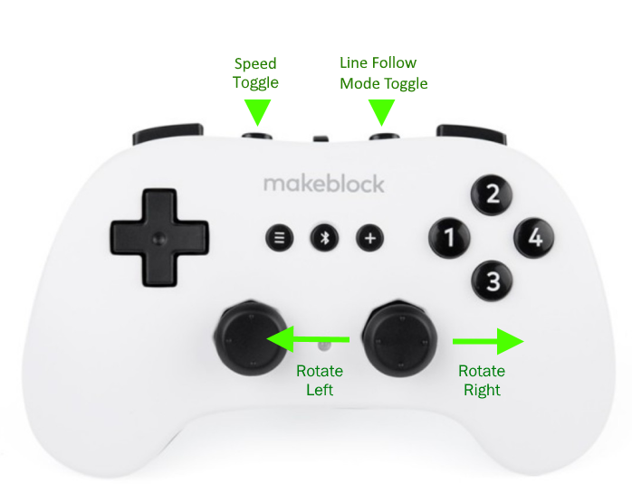
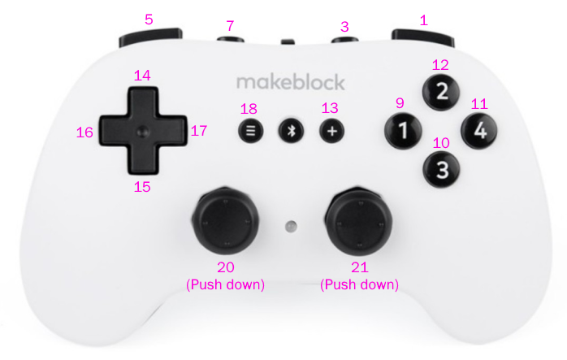
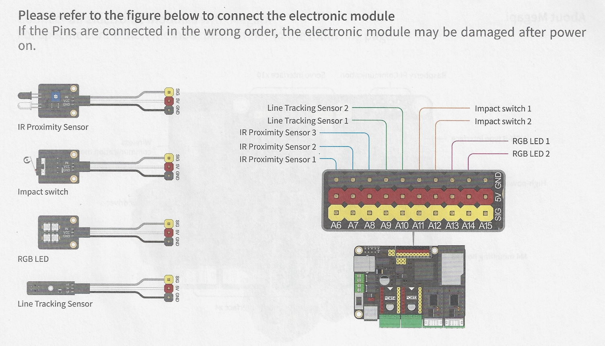
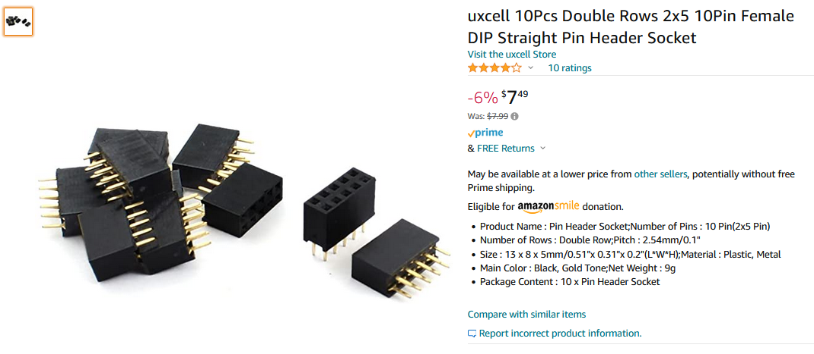
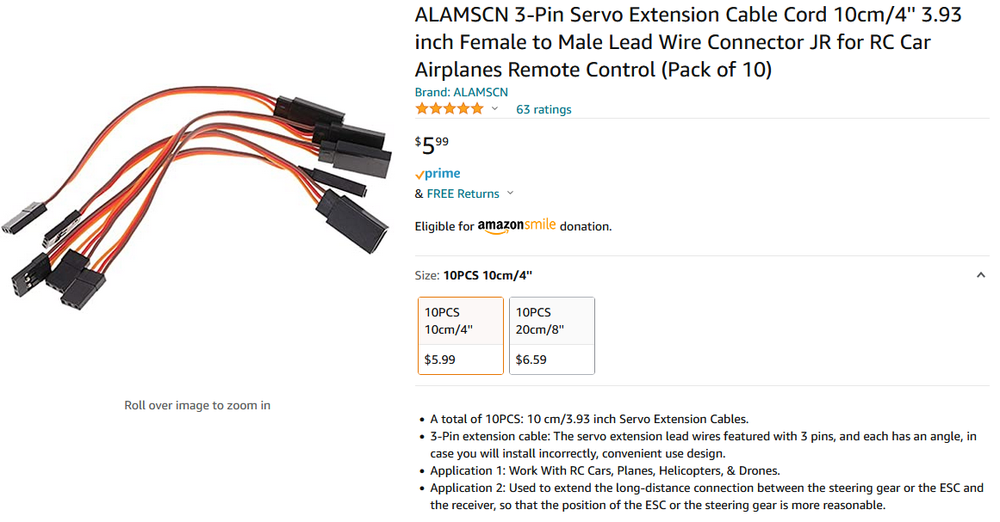
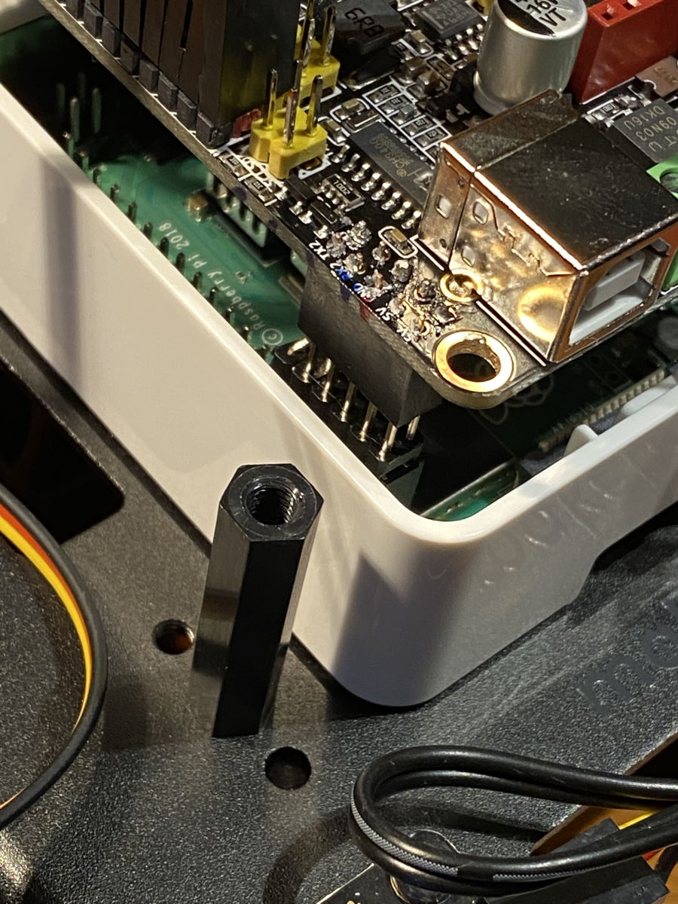
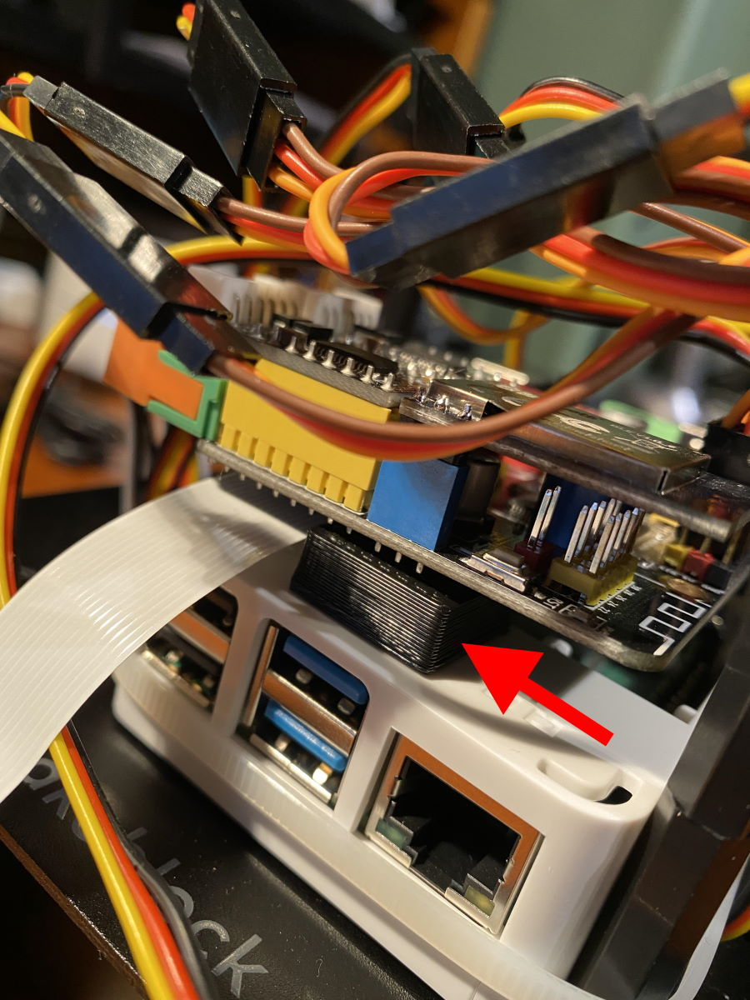

# mbot-mega

My working code for the MBot Mega.  Not affiliated with MakeBlock.

Official support site: https://makeblocksupport.zendesk.com/hc/en-us/sections/1500001152162-mBot-Mega

# Code Examples

- Code: [MBot_Mega_Drive1](https://github.com/david-staas/mbot-mega/blob/master/MBot_Mega_Drive1/MBot_Mega_Drive1.ino), Readme: [Readme](MBot_Mega_Drive1/README.md)


# Driving Control (as implemented in code example above)



## Speed Toggle (L2 Button)
By default, the motors run at max. 50% speed, due to this line:

``` 
float motor_limit = LOW_SPEED;
```

However, if you push the L2 button on the controller, it'll cycle between
LOW_SPEED (50%), MID_SPEED (75%), and HIGH_SPEED (100%) motor limits.

We also set the LEDs to red, yellow, and green according to the power setting.

Note the official documentation says not to run the motors at 100%
when you're using Bluetooth unless you're using Lithium Ion batteries, because there's not
enough power & you get Bluetooth dropouts, but you can mess around with the values.

## Proportional Power Based on Joystick

My code runs the robot faster when the joystick is pushed harder in a direction; the joystick
values are used as part of the multiplier when determining the motor power for each wheel.

## Line Follow Mode

This code was written from scratch as a learning exercise, so it's pretty slow.  It does, however, reliably follow
the line template that comes with the robot.  The LEDs light up when the sensor on that side goes off the
line.  Push R2 to toggle between line follow mode and drive mode.

# General Background on the Controller

## Joystick Analog Values
The [Makeblock library](https://github.com/Makeblock-official/Makeblock-Libraries) has this call that allows you to interrogate the controller's values:

``` 
MePS2.MeAnalog()
```

| Call              | Represents              | Values                     |
|-------------------|-------------------------|----------------------------|
| MePS2.MeAnalog(2) | Left Joystick - X Axis  | -255 (left) to 255 (right) |
| MePS2.MeAnalog(4) | Left Joystick - Y Axis  | -255 (down) to 255 (up)    |
| MePS2.MeAnalog(6) | Right Joystick - X Axis | -255 (left) to 255 (right) |
| MePS2.MeAnalog(8) | Right Joystick - X Axis | -255 (down) to 255 (up)    |

## Button Assignments
The MakeBlock library has this call you can check for a button press:
``` 
MePS2.ButtonPressed(x)
```

Where x is one of the numbers in purple:



# General Background on the Motors for the Wheels

Mine is wired like this, and I followed the factory instructions:

|    Wheel    | Port on Board | Motor # |
|:-----------:|:-------------:|:-------:|
| Left Front  |      2B       |   10    |
|  Left Rear  |      2A       |    2    |
| Right Front |      1A       |    1    |
| Right Rear  |      1B       |    9    |

If you're facing the wheel, motor.run(255) runs the wheel
clockwise at 100% power, motor.run(-255) runs it counterclockwise at 100% power.  Example:

``` 
MeMegaPiDCMotor right_front(1);
...
right_front.run(255);   // 100% power clockwise
right_front.run(-128);  // 50% power counterclockwise
```


# Mecanum Wheel Movements

| Desired Robot Direction | Left Front | Left Rear | Right Front | Right Rear |
|-------------------------|------------|-----------|-------------|------------|
| Forward                 | ↪ CCW ️    | ↪ CCW ️   | ↩ CW        | ↩ CW       |
| Backward                | ↩ CW ️     | ↩ CW ️    | ↪ CCW ️     | ↪ CCW️     |
| Slide Left              | ↩ CW       | ↪ CCW ️   | ↪ CCW ️     | ↩ CW   ️   |
| Slide Right             | ↪ CCW ️    | ↩ CW ️    | ↩ CW ️      | ↪ CCW ️    |
| Rotate Left             | ↩ CW       | ↩ CW      | ↩ CW        | ↩ CW       |
| Rotate Right            | ↪ CCW      | ↪ CCW     | ↪ CCW       | ↪ CCW      |

# LED Modules

There are 2 LED modules with 4 LED beads each on the Mega in ports A13 and A14.  Here's how to address them in Arduino C:

The parameters to ```setColor()``` are as follows:
- Index of the bead to set (0 = all beads, or 1-4 to change an individual bead)
- Red value (0-255)
- Green value (0-255)
- Blue value (0-255)
``` 
#include "src/MeNewRGBLed.h"
MeNewRGBLed rgbled_67(67,4); // Port A13
MeNewRGBLed rgbled_68(68,4); // Port A14
...
rgbled_67.setColor(0, 0,255,0); // Green
rgbled_67.show();
rgbled_67.setColor(0, 0,0,255); // Blue
rgbled_67.show();
rgbled_68.setColor(0, 255,255,255); // White
rgbled_68.show();
rgbled_68.setColor(0, 255,0,0); // Red
rgbled_68.show();
...
rgbled_67.setColor(1,  0, 0, 0); // Turn off bead 1
rgbled_67.show();

```

# Obstacle Avoidance Sensors

There are 3 IR proximity sensors mounted to the vehicle:
- Port A6 (left)
- Port A7 (center)
- Port A8 (right)

``` 
#include "src/MeBarrierSensor.h"
MeBarrierSensor barrier_60(60); // Port A6 (left side)
MeBarrierSensor barrier_61(61); // Port A7 (center)
MeBarrierSensor barrier_62(62); // Port A8 (right side)
...
  if (barrier_62.isBarried() > 0) { 
    // Obstacle detected on right side sensor
  }
```

# Timer

``` 
double currentTime = 0;
double lastTime = 0;

double getLastTime() {
  return currentTime = millis() / 1000.0 - lastTime;
}

...

if (getLastTime() > 5.0) {       // 5.0 seconds
  // Do something here
  lastTime = millis() / 1000.0;  // Reset timer   
}

```

# Line Follow Sensors

There are 2 line sensors:
- Port A9 (left)
- Port A10 (right)

``` 
#include "src/MeSingleLineFollower.h"
MeSingleLineFollower linefollower_63(63); // Port A9 (left)
MeSingleLineFollower linefollower_64(64); // Port A10 (right)

  if ((linefollower_63.readSensor() == 0)) {
    // Left side sensor detected black
  }
  
   if ((linefollower_64.readSensor() == 1)) {
    // Right side sensor detected white
  }
```

# Crash Sensors

There are 2 crash sensors (limit switches) on the rear:
- Port A11 (left)
- Port A12 (right)

``` 
#include "src/MeCollisionSensor.h"
MeCollisionSensor collision_65(65); // Port A11 (left)
MeCollisionSensor collision_66(66); // Port A12 (right)
...
  if (collision_66.isCollision()) {
    // Right side sensor detected collision
  }
```
# Module Port Assignments

From the manual:





# Adding a Raspberry Pi

https://support.makeblock.com/hc/en-us/articles/1500012868722-Program-mBot-Mega-with-Raspberry-Pi-in-Python

https://forum.makeblock.com/t/mbot-mega-from-rpi/18926/9

## Header extender:
In order to connect the Mega's Arduino board to the Raspberry Pi, you'll need a header extender
like this:


## Cut off the unused portion:

I cut mine off with a Dremel so there's only 5 pins:


## Board orientation


## Extending the RasPi pins

Here are the pins you want to extend on the RasPi:


Now you'll want to solder one of these onto the bottom of the Arduino board.  Using 2
separate header extenders like this allows you to separate the boards without desoldering them.



## If you need to extend the sensor cables from underneath

You may need to extend some of the cables using these in order to put the Arduino on top of the RasPi:



## Connect the two header extenders

After soldering, mount the Arduino on top, pushing the one header extender down onto the other:



## Put an 8mm spacer on the opposite side underneath

To support the Arduino on the opposite side.  I just 3D printed a little 8mm high rectangle and
taped it down on top of the RasPi case to support the other end of the Arduino board so there
was no stress on my crappy solder joints.



## Power up and test

Powering up the Arduino should also power up the RasPi, and if you enabled VNC, you should be
able to wait a few minutes until it boots, then remote in.  Or you can hook up a keyboard/mouse
and monitor to program it.

## RasPi Fan

On my other Raspberry Pi 4, I use the little included fan & it does help.  In the
configuration above, there's no good way to mount the fan so I didn't use it - I
hope the RasPi handles the heat OK.  Use this way at your own risk.